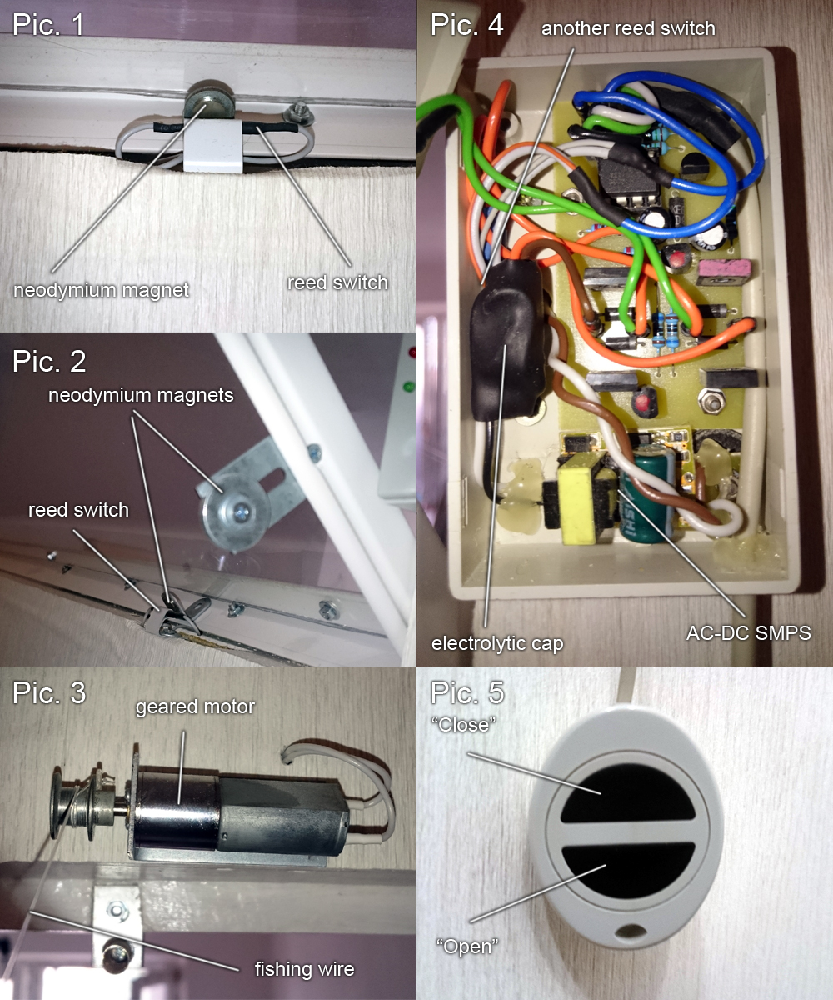

# Automatic window opener

I have a high window looking at a kitchen and several years ago I decided to make it operable by adding an automatic opener. The window is very light construction (~3.5kg) and has been cut from a 4mm plexiglass sheet. Window frame made of foamed (PVC) plastic.
The main idea of this project was to make a simple, non-pneumatic design without any additional moving parts, so I took a look at crane-like mechanisms with winding drums, where the “hook” connected to the window and move it back and forth along the hinges rotation axis (click  if your browser does not support WEBP videos).

In Aliexpress I found a nice, tiny geared motor (12V, 30RPM) with a winding drum (pic. 3) and some neodymium magnets for reed switches. As a rope I use thin, almost invisible fishing wire (pic. 3). To make all this stuff work together a simple control circuit was made in a hurry.

Wired RC with two push-buttons were used to open and close the window (pic. 5). Two reed switches mounted on window slopes to stop the motor when desired position was reached (pic. 2, 4). Neodymium magnets mounted on the window frame (pic. 2). Push-buttons also act like a stop button if one of them is pushed during window movement, so I can open the window just a bit or widely as much as I need.
All these operations were realized by using ATtiny13 microcontroller and BJT H-bridge. CPU is clocked from an internal oscillator which runs at 128 kHz.  As a power supply I used a cheap AC-DC SMPS  (12V, 300mA) with an additional 1000ufx25V electrolytic cap (pic. 4) to smooth DC voltage and provide short-time large current load. In parallel with a motor I attached a simple window movement indicator which can be omitted.

D1 protects a microcontroller from transient switching spikes and parasitic HV impulses in a power line. D2-D5 — flyback diodes, C1-C3 — debouncing chip-capacitors (0805).

**Parts list**\
R1  1.5k (0.25/0.125W)\
R2  1.5k (0.25/0.125W)\
R3  1.5k  (0.25/0.125W)\
R4  510 (0.25/0.125W)\
R5  680 (0.25/0.125W)\
R6  2k  (0.25/0.125W)\
R7  2k  (0.25/0.125W)\
R8  680  (0.25/0.125W)

C1  0.1uf (smd, 0805)\
C2  0.1uf (smd, 0805)\
C3  0.1uf (smd, 0805)\
C4  100ufx10V\
C5  10ufx35V

VD1 1.5KE6.8CA (1N6267)\
VD2 1N4007\
VD3 1N4007\
VD4 1N4007\
VD5 1N4007\
VT1 КТ3102А (2N2222, BC337)\
VT2 КТ3102А (2N2222, BC337)\
VT3 КТ816Г (BD180)\
VT4 КТ817Г (BD179)\
VT5 КТ816Г (BD180)\
VT6 КТ817Г (BD179)\
DA1 LM78L05\
DD1 ATtiny13(A)

SF1 КЭМ-2 (KSK-1B85)\
SF2 КЭМ-2 (KSK-1B85)\
SB1 any tact/pushbutton switch\
SB2 any tact/pushbutton switch
